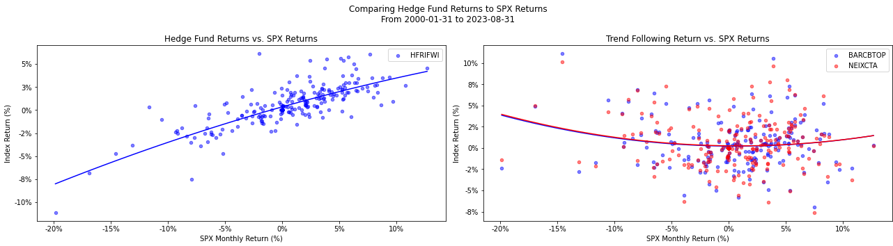
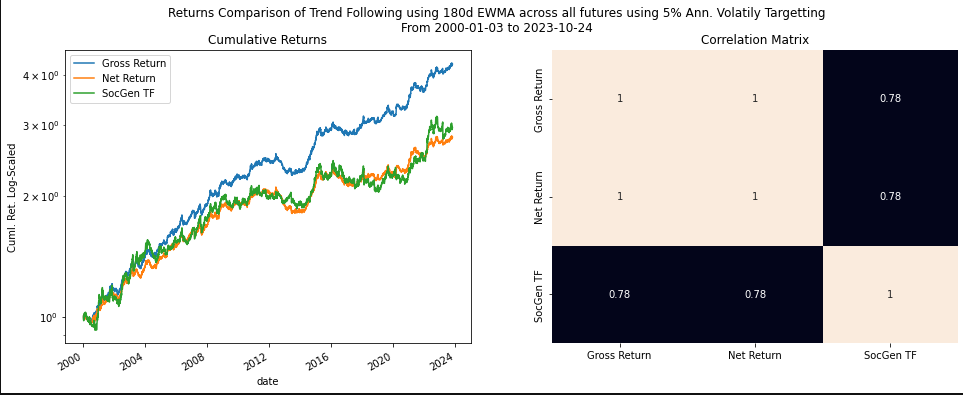
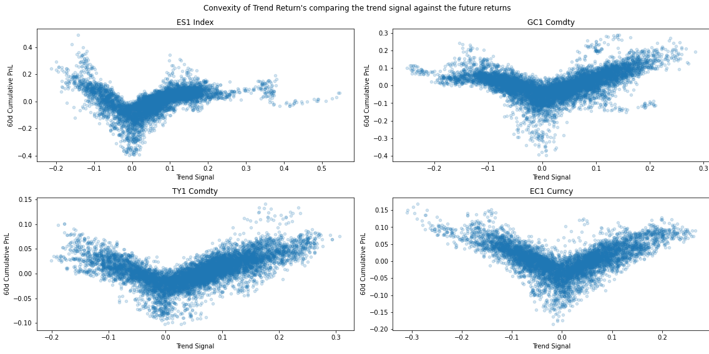

# Trend Convexity
## Background
This repository replicates the results within [_Tail protection for long investors: Trend convexity at work_](https://arxiv.org/abs/1607.02410) by J.P. Bouchaud et. al. This repo analyzes the performance of Trend Following strategies and their relationship to positively convex strategies, which have been researched. 

## CTA and Hedge Fund Performance
Historically, hedge fund strategies are negatively convex to SPX returns while trend following strategies are positively convex. 


## Replicating the Trend Following Returns
The authors outline a very generic approach to replicating returns similar to the Société Generale Trend Following Index. Using a list of liquid futures and applying a 180d EWMA and the approach below with equal risk contribution generates a 75% correlation to the trend following index.

First start by normalizing returns so they have unit variance using differenced price and lagged EWM standard deviation
```math
\begin{equation}
R_t = \frac{D_t}{\sigma_{t-1}} \; \textrm{where} \; \sigma_t := \gamma \sqrt{\mathscr{L}_{\tau_\sigma}[D_t^2]}
\end{equation}
```
Then the aggregate PnL $(G_t)$ over some period $\tau'$ is proportional to its long term volatility over period $\tau$ and its 1-day volatility (which is 1 because its unit variance). In this case $\tau' \thickapprox \frac{\tau}{2}$. 
```math
\mathcal{L}_{\tau'}[G_t] = \frac{\lambda \tau}{\tau - 1} \left( \tau \mathcal{L}_{\tau}^2 [R_t] - \mathcal{L}_{\tau'}[R_t^2] \right)
```


To see the convex nature of the signal's performance using S&P Minis, Gold, Treasury, and EUR futures as proxies the convexity of the returns can be seen. 
